# Pokédex MongoDB - Interfaz Streamlit

## Descripción
Esta aplicación es una interfaz web desarrollada con **Streamlit** para gestionar una base de datos de Pokémon en **MongoDB**. Permite crear y eliminar bases de datos y colecciones, insertar, buscar, actualizar y eliminar Pokémon y sus ataques. Fue desarrollada rápidamente como proyecto de máster, manteniendo funcionalidades básicas de CRUD y conexión a MongoDB. 

> [!NOTE]  
> En un principio ha sido pensado para consultar la colección de Pokemon, pero lo he ampliado en 30 minutos para poder consultar otras colecciones o bases de datos.

## Estructura del proyecto

```mermaid
flowchart TD
    style A fill:#f9f,stroke:#333,stroke-width:2px
    style B fill:#bbf,stroke:#333,stroke-width:1px
    style C fill:#bbf,stroke:#333,stroke-width:1px
    style D fill:#bfb,stroke:#333,stroke-width:1px
    style E fill:#bfb,stroke:#333,stroke-width:1px
    style F fill:#ffb,stroke:#333,stroke-width:1px
    style G fill:#ffb,stroke:#333,stroke-width:1px
    style H fill:#ffb,stroke:#333,stroke-width:1px

    A[Proyecto Pokédex MongoDB]:::root
    B[📁 classes]:::folder
    C[📁 database]:::folder
    D[conector_bd.py]:::file
    E[pokemon.py]:::file
    F[main.py]:::file
    G[.env]:::file
    H[README.md]:::file

    A --> B
    B --> C
    C --> D
    B --> E
    A --> F
    A --> G
    A --> H
```



## Configuración
1. Clona el repositorio:
```bash
# Clonar desde el repositorio y moverse al directorio.
git clone https://github.com/rat-in-machine/MongoDB-Pokedex
cd MongoDB-Pokedex

# Importar dependencias.
pip install -r requirements.txt 
```

2. Crear archivo .env en la raíz del proyecto:

```bash
DB_USER=<usuario_mongodb>           # Usaurio de la base de datos.
DB_PASSWORD=<contraseña_mongodb>    # Contraseña de usuario.
DB_URL=<url_mongodb>                # URI de la base de datos.
DB_NAME=<nombre_base_de_datos>      # Nombre de la base de datos.
```

3. Ejecutar programa:

```bash
streamlit run ./main.py  # Ejecutar programa.
```

